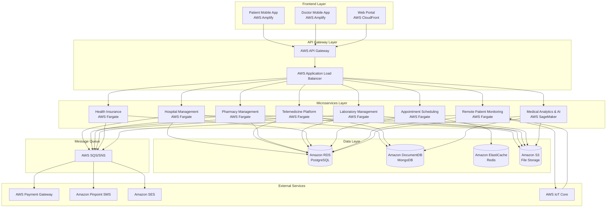
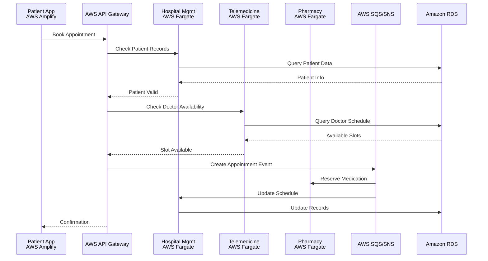
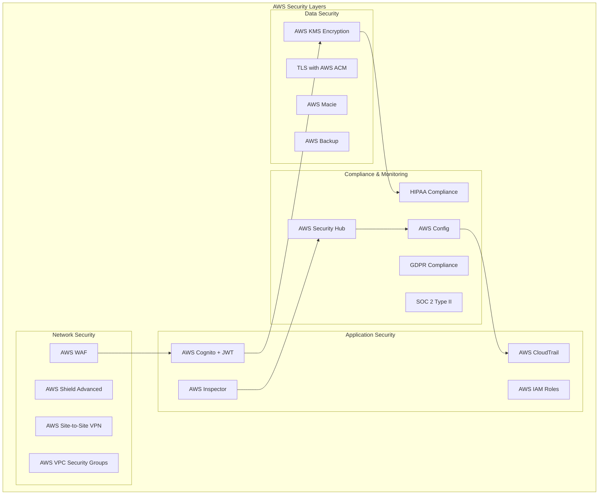
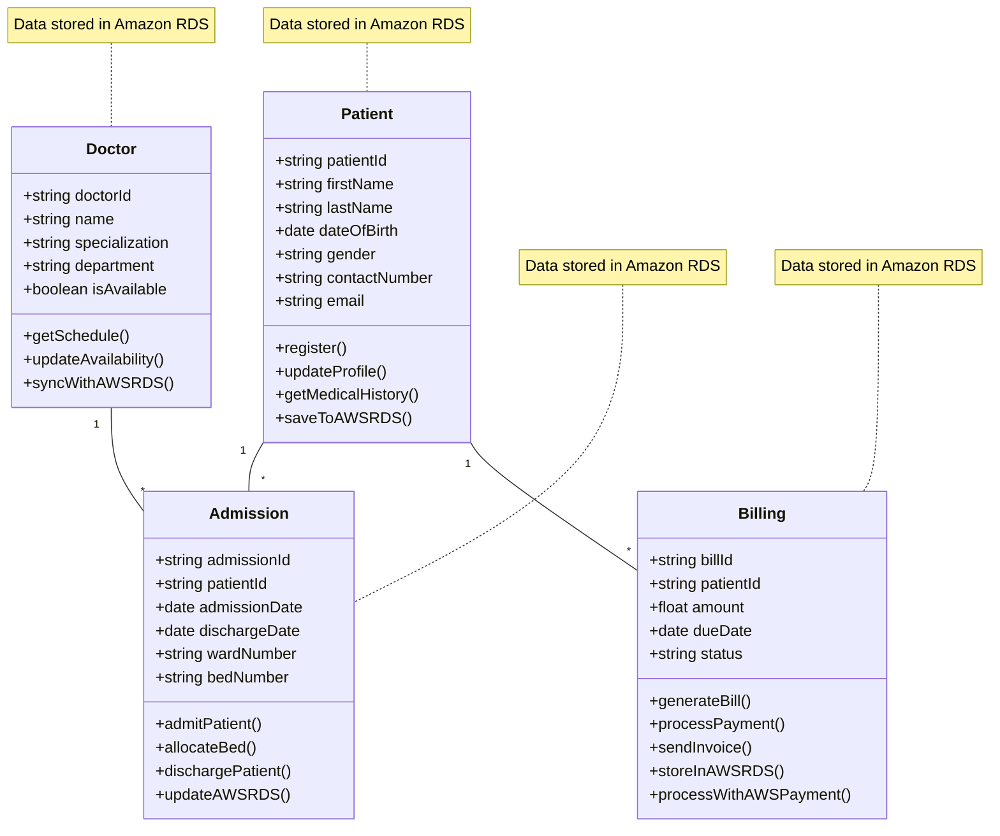
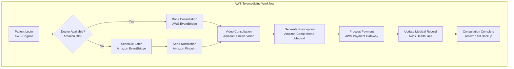
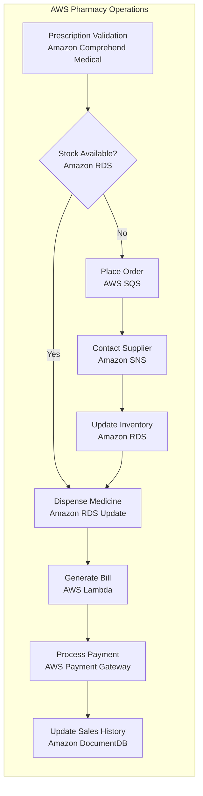
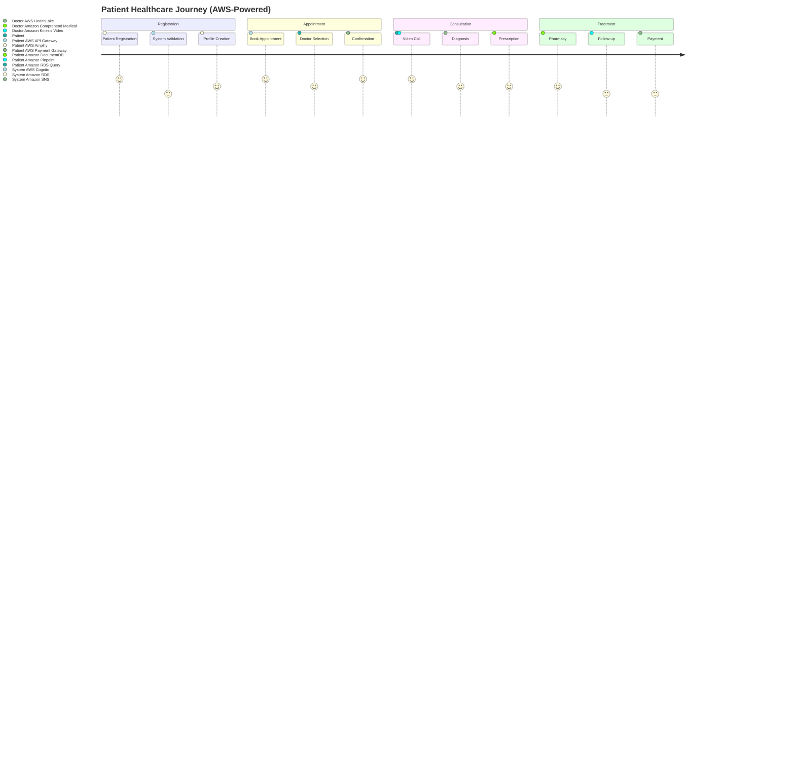
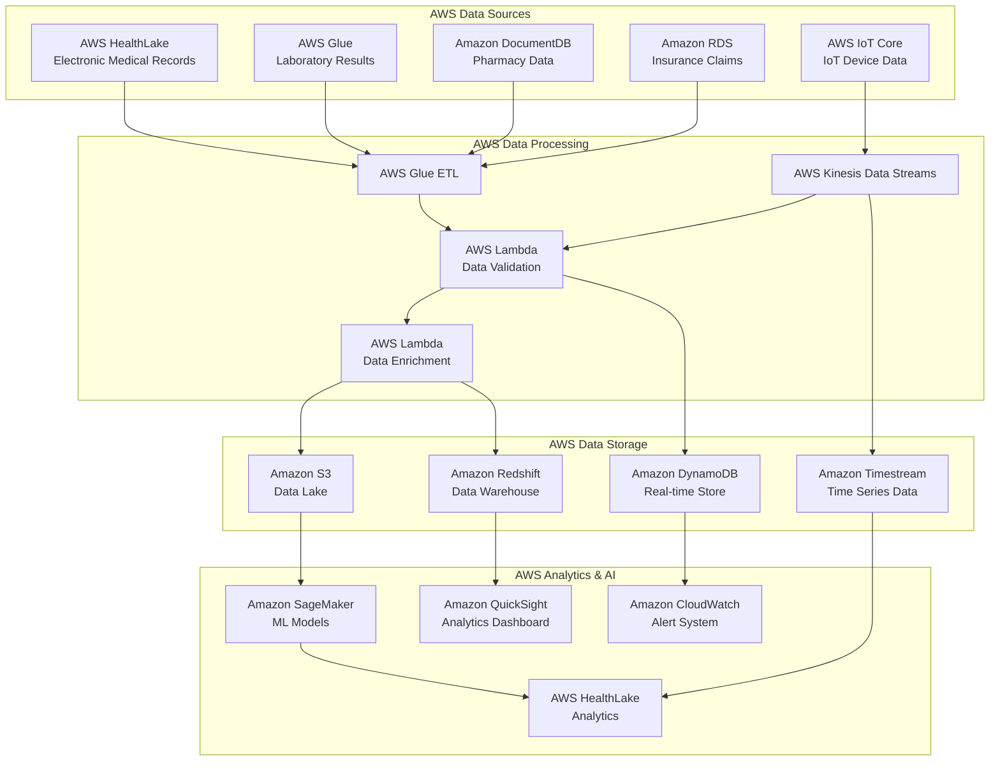
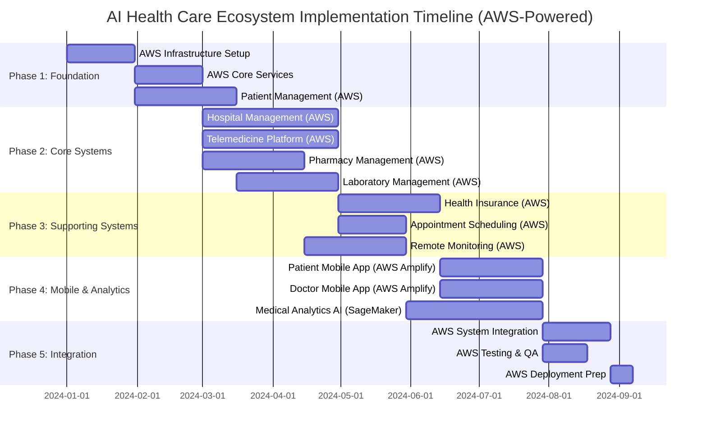

# AI Health Care and Telecommunication Ecosystem - Architecture & Implementation

## Table of Contents
1. [System Architecture Overview](#system-architecture-overview)
2. [Technology Stack](#technology-stack)
3. [Security & Compliance](#security--compliance)
4. [Module-by-Module Architecture](#module-by-module-architecture)
5. [Data Flow Architecture](#data-flow-architecture)
6. [Implementation Plan](#implementation-plan)
7. [Timeline & Gantt Chart](#timeline--gantt-chart)

## System Architecture Overview

### Ecosystem Architecture

### Microservices Communication Pattern

## Technology Stack

### Backend Technologies
- **API Gateway**: AWS API Gateway
- **Microservices**: Node.js/Express.js with TypeScript
- **Databases**: 
  - Amazon RDS for PostgreSQL (Relational data)
  - Amazon DocumentDB for MongoDB (Document storage)
  - Amazon ElastiCache for Redis (Caching & Sessions)
- **Message Queue**: AWS SQS (Simple Queue Service) and SNS (Simple Notification Service) for event-driven architecture
- **Authentication**: JWT with OAuth 2.0
- **File Storage**: Amazon S3 (Simple Storage Service)

### Frontend Technologies
- **Web Application**: React.js with TypeScript
- **Mobile Applications**: React Native
- **UI Framework**: Material-UI (MUI)
- **State Management**: Redux Toolkit
- **Charts & Analytics**: Chart.js / D3.js

### Infrastructure & DevOps
- **Cloud Provider**: AWS
- **Containerization**: Docker with Amazon EKS (Elastic Kubernetes Service)
- **CI/CD**: AWS CodePipeline, AWS CodeBuild, and AWS CodeDeploy
- **Monitoring**: AWS CloudWatch with AWS X-Ray for distributed tracing
- **Logging**: AWS CloudWatch Logs and AWS CloudWatch Insights
- **API Documentation**: Swagger/OpenAPI 3.0

### Healthcare Standards
- **Data Exchange**: HL7 FHIR R4
- **Security**: HIPAA Compliant Encryption (AES-256)
- **Compliance**: SOC 2 Type II, GDPR
- **Interoperability**: DICOM for medical imaging

## Security & Compliance

### Security Architecture

### Data Privacy & Protection
- **Patient Data**: End-to-end encryption
- **Access Control**: Multi-factor authentication
- **Audit Trails**: Complete activity logging
- **Data Retention**: Configurable retention policies
- **Backup & Recovery**: AWS Backup with automated daily backups and cross-region replication

## Module-by-Module Architecture

### 1. Hospital Management System

### 2. Telemedicine Platform

### 3. Pharmacy Management System

## Data Flow Architecture

### Patient Journey Data Flow

### Cross-Module Data Integration

## Implementation Plan

### Phase 1: Foundation (Months 1-2)

#### Core Infrastructure
- AWS Cloud environment setup with VPC, subnets, and security groups
- Amazon EKS cluster configuration with managed node groups
- AWS CodePipeline, CodeBuild, and CodeDeploy for CI/CD
- AWS CloudWatch, CloudWatch Logs, and AWS X-Ray for monitoring and logging
- AWS IAM, AWS KMS, and AWS Security Hub for security framework implementation
- AWS WAF, AWS Shield, and AWS DDoS Protection for network security

#### Core Services
- Authentication & Authorization Service using AWS Cognito
- AWS API Gateway configuration with custom domain and throttling
- Database architecture setup with Amazon RDS, DocumentDB, and ElastiCache
- AWS SQS and SNS for message queue implementation
- Patient Management System (Core Module)

#### Key Deliverables
- ✅ Development environment ready
- ✅ Authentication system functional
- ✅ Patient registration and profile management
- ✅ Basic API documentation

### Phase 2: Core Systems (Months 3-5)

#### Hospital Management System
- Admission & discharge workflows
- Doctor scheduling system
- Bed and ward management
- Medical records integration
- Billing and invoicing

#### Telemedicine Platform
- Video consultation infrastructure using Amazon Kinesis Video Streams
- Appointment booking system with Amazon EventBridge
- Prescription management with Amazon Comprehend Medical
- Payment integration using AWS Payment Gateway integration
- Consultation history stored in Amazon DocumentDB

#### Pharmacy Management System
- Inventory management
- Prescription processing
- Supplier management
- POS system
- Expiry tracking

#### Laboratory Management System
- Test booking and catalog
- Sample tracking
- Result management
- Report generation
- Integration with EHR

### Phase 3: Supporting Systems (Months 6-8)

#### Health Insurance Management
- Policy management
- Claims processing
- Premium calculation
- Customer management
- Workflow automation

#### Appointment & Scheduling System
- Advanced scheduling algorithms
- Resource optimization
- Multi-location support
- Queue management
- Notification system

#### Remote Patient Monitoring
- IoT device integration using AWS IoT Core
- Real-time data collection with AWS IoT Analytics
- Alert system using Amazon SNS and CloudWatch Alarms
- Patient dashboard using AWS Amplify
- Doctor dashboard with real-time updates via AWS AppSync

### Phase 4: Mobile & Analytics (Months 9-11)

#### Mobile Applications
- Patient mobile app (iOS/Android) using AWS Amplify
- Doctor mobile app (iOS/Android) using AWS Amplify
- Offline functionality with AWS AppSync
- Push notifications using Amazon Pinpoint
- User experience optimization with AWS CloudFront CDN

#### Medical Analytics & AI Platform
- Data aggregation pipeline using AWS Glue
- Machine learning models with Amazon SageMaker
- Predictive analytics using Amazon SageMaker Canvas
- Risk scoring algorithms with Amazon SageMaker Autopilot
- Business intelligence dashboards using Amazon QuickSight

### Phase 5: Integration & Testing (Month 12)

#### System Integration
- End-to-end workflow testing
- Performance optimization
- Security audit and penetration testing
- Data migration and validation
- User acceptance testing

#### Deployment Preparation
- Production environment setup with AWS CloudFormation/CDK
- Backup and disaster recovery using AWS Backup and cross-region replication
- Training materials hosted on AWS S3 with CloudFront distribution
- Go-live preparation with AWS CloudFormation stacks
- Post-launch support plan using AWS Support Enterprise

## Timeline & Gantt Chart

### 12-Month Implementation Timeline

### Resource Allocation

#### Team Structure
- **Project Manager**: 1 FTE (Full-time equivalent)
- **Solution Architect**: 1 FTE
- **Backend Developers**: 4 FTE
- **Frontend Developers**: 3 FTE
- **Mobile Developers**: 2 FTE
- **DevOps Engineers**: 2 FTE
- **QA Engineers**: 2 FTE
- **UI/UX Designers**: 1 FTE
- **Security Specialist**: 1 FTE

#### Budget Estimates
- **AWS Infrastructure**: $50,000/month
  - Compute: Amazon EKS, EC2 instances, Lambda functions
  - Storage: Amazon S3, RDS, DocumentDB, ElastiCache
  - Networking: VPC, CloudFront, Route 53
  - Data Transfer: AWS Data Transfer costs
- **Personnel**: $150,000/month
- **Software Licenses**: $10,000/month
- **AWS Compliance & Security**: $15,000/month
  - AWS Security Hub, AWS Config, AWS IAM Access Analyzer
  - AWS KMS, AWS Certificate Manager
- **AWS Contingency (15%)**: $33,750/month

### Risk Assessment & Mitigation

#### High-Risk Areas
1. **Healthcare Compliance**
   - Risk: Non-compliance with HIPAA/HL7 standards
   - Mitigation: Early engagement with compliance experts, regular audits

2. **Data Security**
   - Risk: Data breaches affecting patient information
   - Mitigation: End-to-end encryption, regular security assessments

3. **Integration Complexity**
   - Risk: Complex integrations between 10 modules
   - Mitigation: API-first approach, comprehensive testing

4. **User Adoption**
   - Risk: Low adoption by healthcare professionals
   - Mitigation: User-centered design, extensive training programs

5. **Performance at Scale**
   - Risk: System performance issues with high load
   - Mitigation: Load testing, scalable architecture design

### Success Metrics

#### Technical Metrics
- **System Availability**: 99.9% uptime using AWS Multi-AZ and Auto Scaling
- **Response Time**: <2 seconds for critical operations with AWS CloudFront CDN
- **Security**: Zero critical vulnerabilities with AWS Security Hub and AWS Inspector
- **Scalability**: Support for 1M+ concurrent users using Amazon EKS Auto Scaling

#### Business Metrics
- **User Adoption**: 80% activation within 3 months
- **Patient Satisfaction**: >4.5/5 rating
- **Operational Efficiency**: 40% reduction in administrative tasks
- **Cost Reduction**: 30% reduction in operational costs

#### Compliance Metrics
- **HIPAA Compliance**: 100% audit pass rate with AWS HIPAA-eligible services
- **Data Privacy**: Zero data breaches with AWS KMS encryption and IAM policies
- **Interoperability**: Full HL7 FHIR compliance with AWS HealthLake integration
- **Audit Trail**: 100% activity logging with AWS CloudTrail and CloudWatch Logs

---

*This document provides a comprehensive architecture and implementation plan for the AI Health Care and Telecommunication ecosystem. The plan emphasizes security, scalability, and healthcare compliance while ensuring a phased approach to development and deployment.*
