# AI Health Care and Telecommunication Ecosystem - Architecture & Implementation

3. ## Table of Contents
4. 1. [System Architecture Overview](#system-architecture-overview)
5.    - [Ecosystem Architecture](#ecosystem-architecture)
6.    - [Detailed Infrastructure, DevOps & Container Orchestration Architecture](#detailed-infrastructure-devops--container-orchestration-architecture)
7.    - [Request and Deployment Flowcharts](#request-and-deployment-flowcharts)
8.    - [Microservices Communication Pattern](#microservices-communication-pattern)
9. 2. [CI/CD Workflow Design (Jenkins, Docker, Kubernetes & AWS)](#cicd-workflow-design-jenkins-docker-kubernetes--aws)
10. 3. [Technology Stack](#technology-stack)
11. 4. [Security & Compliance](#security--compliance)
12. 5. [Module-by-Module Architecture](#module-by-module-architecture)
13. 6. [Data Flow Architecture](#data-flow-architecture)
14. 7. [Implementation Plan](#implementation-plan)
15. 8. [Timeline, Gantt Chart](#timeline--gantt-chart)

## System Architecture Overview

### Ecosystem Architecture

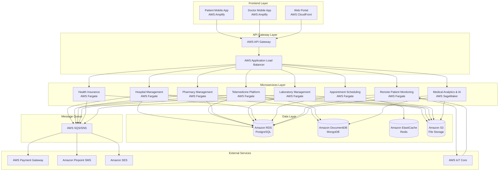

### Detailed Infrastructure, DevOps & Container Orchestration Architecture

```mermaid
graph TB
    subgraph "1. CI/CD DevOps Pipeline (Jenkins & Docker)"
        Git[GitHub Repository] -->|Webhook Trigger| Jenkins[Jenkins CI/CD Server]
        subgraph "Jenkins Agent Node"
            DockerB[Docker Daemon]
            Lint[ESLint & Jest Tests]
        end
        Jenkins -->|Runs Lint/Unit Tests| Lint
        Jenkins -->|Builds Container Image| DockerB
        DockerB -->|Pushes Docker Images| ECR[Amazon ECR<br/>Elastic Container Registry]
        Jenkins -->|Applies Manifests/Helm| EKS_Ctrl[EKS Control Plane<br/>Kubernetes Master Node]
    end

    subgraph "2. AWS VPC Network Topology"
        subgraph "Public Subnets (Route Table: IGW)"
            ALB[Application Load Balancer<br/>AWS ALB]
            NAT[NAT Gateways<br/>Outgoing Traffic]
            Bastion[Bastion Host / Jump Box]
            
            subgraph "Public Security Group (SG-ALB)"
                ALB
            end
        end

        subgraph "Private Application Subnets (Route Table: NAT)"
            subgraph "AWS EKS Cluster (Elastic Kubernetes Service)"
                subgraph "Kubernetes Worker Nodes (EC2 Autoscaling Group)"
                    subgraph "K8s Namespace: ingress-nginx"
                        Ingress[Nginx Ingress Controller]
                    end

                    subgraph "K8s Namespace: app-prod (Docker Pods)"
                        HMS_Pod[Hospital Mgmt Pod<br/>Docker Container]
                        TP_Pod[Telemedicine Pod<br/>Docker Container]
                        PMS_Pod[Pharmacy Pod<br/>Docker Container]
                        RPM_Pod[RPM Pod<br/>Docker Container]
                    end

                    subgraph "K8s Namespace: monitoring"
                        Prom[Prometheus Server]
                        Graf[Grafana Dashboards]
                    end
                end
            end

            subgraph "Private Application Security Group (SG-EKS)"
                Ingress
                HMS_Pod
                TP_Pod
                PMS_Pod
                RPM_Pod
                Prom
                Graf
            end
        end

        subgraph "Isolated Database Subnets (No Internet Route)"
            subgraph "Amazon RDS (PostgreSQL Cluster)"
                RDS_Primary[(RDS Postgres Primary)]
                RDS_Replica[(RDS Postgres Replica)]
            end

            subgraph "NoSQL & Caching Tier"
                DocDB[(Amazon DocumentDB<br/>MongoDB Cluster)]
                Redis[(Amazon ElastiCache<br/>Redis Master/Replica)]
            end

            subgraph "Database Security Group (SG-DB)"
                RDS_Primary
                RDS_Replica
                DocDB
                Redis
            end
        end

        subgraph "Global AWS Infrastructure & Monitoring"
            S3[(Amazon S3 Bucket<br/>Encrypted HIPAA Storage)]
            CW[AWS CloudWatch Logs<br/>Container Insights]
            XRay[AWS X-Ray Daemon<br/>Distributed Tracing]
        end
    end

    %% Network & Ingress Routing Traffic
    InternetTraffic[Client Request] -->|HTTPS:443| ALB
    ALB -->|Forward Target Group| Ingress
    Ingress -->|Route rules| HMS_Pod
    Ingress -->|Route rules| TP_Pod
    Ingress -->|Route rules| PMS_Pod
    Ingress -->|Route rules| RPM_Pod

    %% Container Deploy Flow
    ECR -->|Pull Docker Images| HMS_Pod
    ECR -->|Pull Docker Images| TP_Pod
    ECR -->|Pull Docker Images| PMS_Pod
    ECR -->|Pull Docker Images| RPM_Pod

    %% Database Connection Flows
    HMS_Pod & TP_Pod & PMS_Pod & RPM_Pod -->|SG-DB Access| RDS_Primary
    HMS_Pod & TP_Pod & PMS_Pod & RPM_Pod -->|SG-DB Access| DocDB
    HMS_Pod & TP_Pod & PMS_Pod & RPM_Pod -->|SG-DB Access| Redis
    HMS_Pod & TP_Pod & PMS_Pod & RPM_Pod -->|Upload Assets| S3

    %% Monitoring, Metrics & Tracing Flow
    Prom -->|Scrape metrics| HMS_Pod & TP_Pod & PMS_Pod & RPM_Pod
    Graf -->|Query metrics| Prom
    HMS_Pod & TP_Pod & PMS_Pod & RPM_Pod -->|Push Logs| CW
    HMS_Pod & TP_Pod & PMS_Pod & RPM_Pod -->|Send Trace segments| XRay
```

### Request and Deployment Flowcharts

#### End-to-End Request Routing Flow

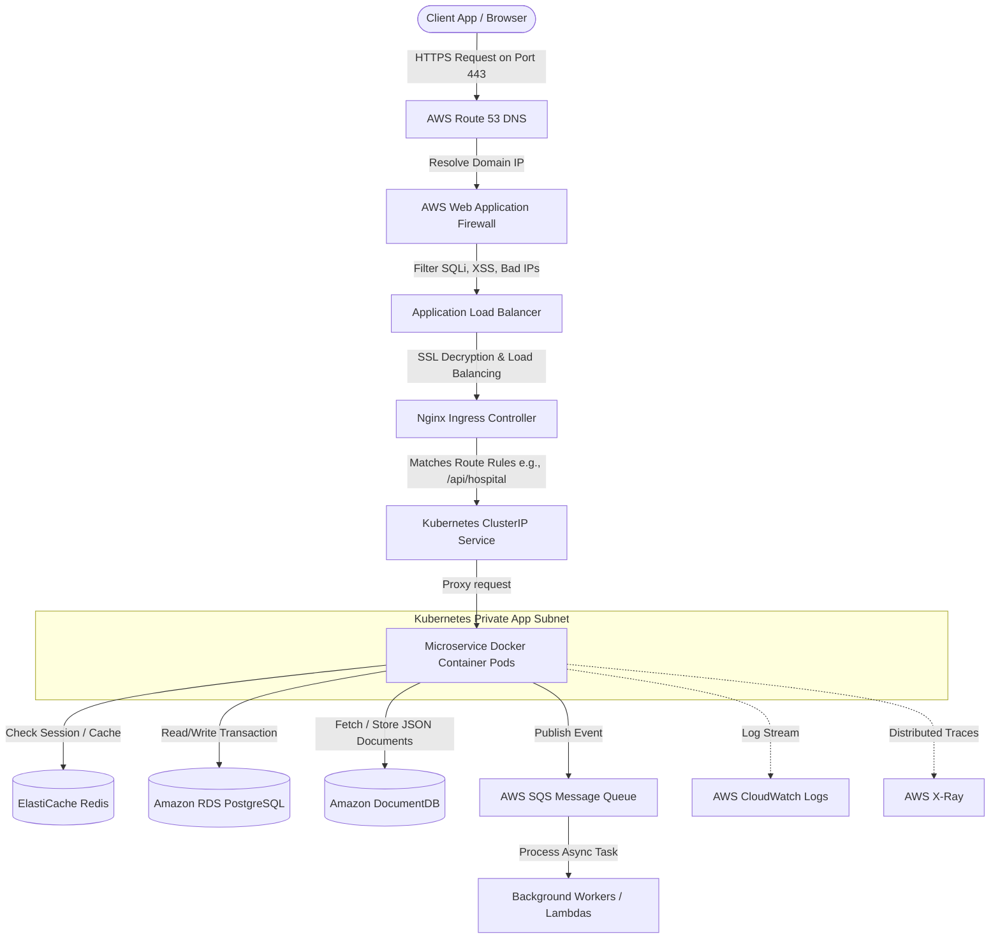

#### EKS CI/CD Deployment Flow (Jenkins + Docker + Kubernetes)

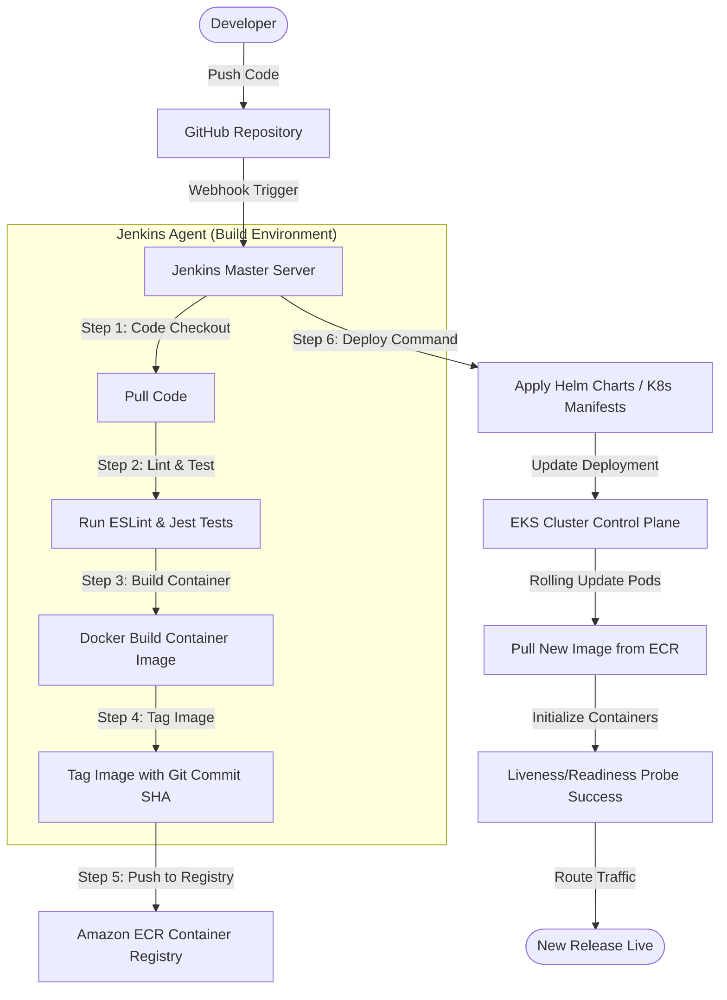

### Microservices Communication Pattern

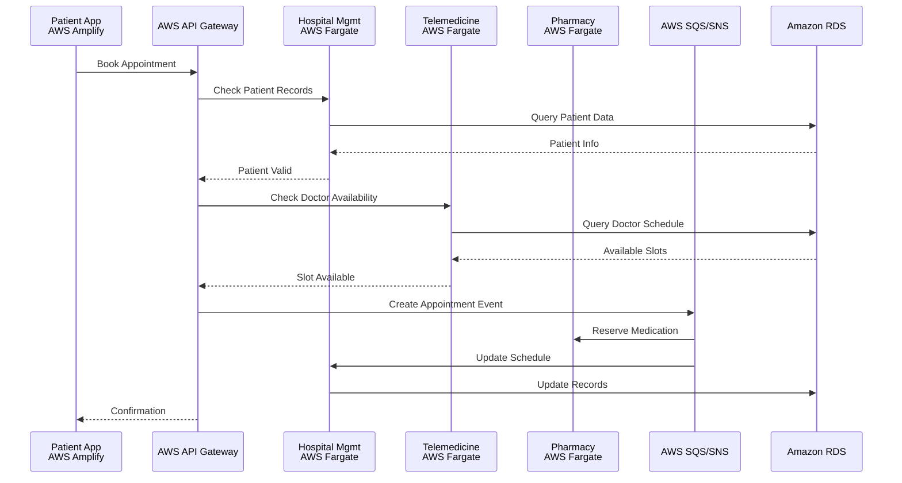


## CI/CD Workflow Design (Jenkins, Docker, Kubernetes & AWS)

This section provides a detailed architectural specification of the CI/CD pipeline, detailing the continuous integration and continuous deployment mechanics across AWS, Jenkins, Docker, and Kubernetes (EKS).

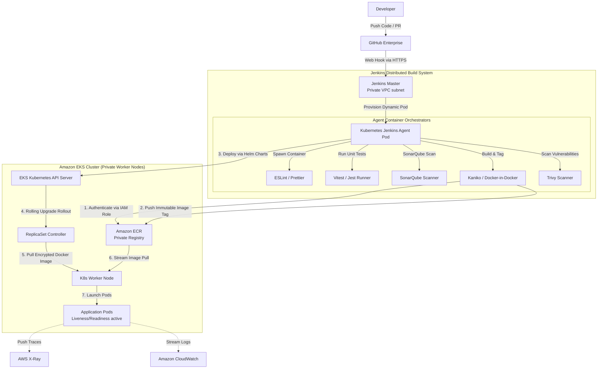

### 1. Architectural Components & Pipeline Stages

The CI/CD pipeline is designed for enterprise-grade high availability, security (HIPAA-compliant, private networking), and velocity.

#### A. Code & Event Orchestration
*   **Version Control**: GitHub Enterprise repository.
*   **Webhooks**: Configured with TLS authentication payload tokens. Triggers Jenkins pipelines exclusively on `Pull Request Merge` to `main`/`release` branches and target feature branches.

#### B. Distributed Jenkins Infrastructure
*   **Jenkins Master**: Hosted in a private subnet on AWS EC2, protected behind an internal ALB and VPN. No public ingress is permitted.
*   **Dynamic Agents**: Jenkins leverages the **Kubernetes Plugin** to spin up ephemeral agent pods inside EKS on demand. This saves cost and ensures clean, isolated workspaces for every execution.

#### C. Pipeline Phase-by-Phase Breakdown

| Phase | Tooling | Description | Failure Policy |
| :--- | :--- | :--- | :--- |
| **1. Checkout** | Git | Clones repository using SSH deploy key stored securely in Jenkins credentials helper. | Terminate build |
| **2. Lint & Validate** | ESLint, Prettier, TypeScript Compiler (`tsc`) | Static code parsing to enforce project standards and type safety. | Terminate build |
| **3. Unit Testing** | Vitest, Supertest, LocalStack | Runs tests in isolated node container. Generates JUnit XML and coverage reports. | Terminate build (coverage < 80%) |
| **4. Code Quality Gate** | SonarQube | Quality analysis scanner checking for security hotspots, code smells, and bugs. | Block pipeline if gate fails |
| **5. Build & Package** | Docker (Kaniko) | Builds a multi-stage production Docker container using Kaniko to avoid root-privilege Docker-in-Docker requirements. | Terminate build |
| **6. Image Scan** | Trivy | Scans built Docker layers for CVEs. Alerts on High/Critical vulnerabilities. | Fail build if High/Critical CVEs found |
| **7. ECR Publish** | AWS CLI, Docker | Authenticates to ECR using IAM role assumed by the agent pod (no long-lived credentials) and pushes image tagged with `<git-commit-sha>` and `<version>`. | Terminate build |
| **8. Deploy to EKS** | Helm v3, kubectl | Executes `helm upgrade --install` with target override files for specific namespaces (`app-prod` or `app-staging`). | Initiates automatic rollback |
| **9. Validation** | Kubernetes Probes | Monitors rollout with `kubectl rollout status`. Asserts success of Liveness and Readiness probes. | Triggers Helm rollback if status != success |

---

### 2. Declarative Jenkinsfile Blueprint

```groovy
pipeline {
    agent {
        kubernetes {
            yaml """
apiVersion: v1
kind: Pod
metadata:
  labels:
    some-label: jenkins-agent
spec:
  serviceAccountName: jenkins-agent-irsa
  containers:
  - name: nodejs
    image: node:18-alpine
    command: ['cat']
    tty: true
  - name: kaniko
    image: gcr.io/kaniko-project/executor:v1.9.1-debug
    command: ['cat']
    tty: true
  - name: helm
    image: alpine/helm:3.11.2
    command: ['cat']
    tty: true
"""
        }
    }

    environment {
        AWS_DEFAULT_REGION = 'us-east-1'
        ECR_REGISTRY       = '123456789012.dkr.ecr.us-east-1.amazonaws.com'
        IMAGE_NAME         = 'ai-healthcare-hospital-service'
        APP_NAME           = 'hospital-service'
        NAMESPACE          = 'app-prod'
    }

    stages {
        stage('Checkout') {
            steps {
                checkout scm
            }
        }

        stage('Static Code Analysis') {
            steps {
                container('nodejs') {
                    sh 'npm ci'
                    sh 'npm run lint'
                    sh 'npm run test:unit -- --coverage'
                }
            }
        }

        stage('SonarQube Quality Gate') {
            steps {
                // Ensure SonarQube server is configured in Jenkins System Configure
                withSonarQubeEnv('SonarQube-Server') {
                    container('nodejs') {
                        sh 'npm run sonar-scan'
                    }
                }
                timeout(time: 10, unit: 'MINUTES') {
                    waitForQualityGate abortPipeline: true
                }
            }
        }

        stage('Dockerize & Scan Image') {
            steps {
                container('kaniko') {
                    // Kaniko compiles the image without host root permissions
                    sh """
                        /kaniko/executor \
                        --context=dir://. \
                        --dockerfile=Dockerfile \
                        --destination=${ECR_REGISTRY}/${IMAGE_NAME}:${env.BUILD_NUMBER} \
                        --destination=${ECR_REGISTRY}/${IMAGE_NAME}:latest \
                        --cache=true
                    """
                }
            }
        }

        stage('Deploy to Kubernetes') {
            steps {
                container('helm') {
                    // Deploy via Helm, pointing to the built ECR image tag
                    sh """
                        helm upgrade --install ${APP_NAME} ./charts/${APP_NAME} \
                        --namespace ${NAMESPACE} \
                        --set image.repository=${ECR_REGISTRY}/${IMAGE_NAME} \
                        --set image.tag=${env.BUILD_NUMBER} \
                        --wait \
                        --timeout 5m
                    """
                }
            }
        }
    }
    
    post {
        failure {
            slackSend channel: '#alerts-devops',
                      color: '#FF0000',
                      message: "Pipeline Failed: ${env.JOB_NAME} [Build #${env.BUILD_NUMBER}] (${env.BUILD_URL})"
        }
        success {
            slackSend channel: '#alerts-devops',
                      color: '#00FF00',
                      message: "Pipeline Succeeded: ${env.JOB_NAME} [Build #${env.BUILD_NUMBER}] (${env.BUILD_URL})"
        }
    }
}
```

---

### 3. Production Dockerization Pattern (Multi-Stage Node.js/TypeScript)

To maximize runtime security and keep container images minimal, we use a multi-stage Docker build pattern. The final image contains only compiled production assets and no developer tooling.

```dockerfile
# ==========================================
# Stage 1: Build & Compilation
# ==========================================
FROM node:18-alpine AS builder

WORKDIR /usr/src/app

# Copy dependency manifests
COPY package*.json tsconfig.json ./

# Install all dependencies (including devDependencies for build)
RUN npm ci

# Copy application source code
COPY src ./src

# Compile TypeScript to JavaScript
RUN npm run build

# Remove development dependencies to keep final node_modules clean
RUN npm prune --production

# ==========================================
# Stage 2: Minimal Runtime Environment
# ==========================================
FROM node:18-alpine AS runner

WORKDIR /usr/src/app

# Set production environment flags
ENV NODE_ENV=production
ENV PORT=3000

# Create a non-root group and user for security compliance (HIPAA recommendation)
RUN addgroup -g 1001 -S nodejs && \
    adduser -u 1001 -S nextjs -G nodejs

# Copy only the compiled code and production node_modules from builder stage
COPY --from=builder /usr/src/app/dist ./dist
COPY --from=builder /usr/src/app/node_modules ./node_modules
COPY package*.json ./

# Switch to the non-root execution context
USER nextjs

EXPOSE 3000

# Perform healthcheck to ensure local container health
HEALTHCHECK --interval=30s --timeout=5s --start-period=10s --retries=3 \
  CMD wget --no-verbose --tries=1 --spider http://localhost:3000/health || exit 1

CMD ["node", "dist/app.js"]
```

---

### 4. Kubernetes EKS Orchestration & IAM Integration

#### A. IAM Roles for Service Accounts (IRSA)
To satisfy security guidelines, Kubernetes pods do not leverage hardcoded AWS Access Keys or Secret Keys. Instead, we use EKS **IRSA**:
1. An AWS IAM Role is created with policies allowing only specific actions (e.g., read AWS Secrets Manager, put metric data to CloudWatch).
2. The IAM Role is annotated on a Kubernetes `ServiceAccount`:
   ```yaml
   apiVersion: v1
   kind: ServiceAccount
   metadata:
     name: hospital-service-sa
     namespace: app-prod
     annotations:
       eks.amazonaws.com/role-arn: arn:aws:iam::123456789012:role/hospital-service-app-role
   ```
3. The pod's deployment specification declares `serviceAccountName: hospital-service-sa`. The AWS SDK inside the container automatically resolves credentials via the OpenID Connect (OIDC) identity provider.

#### B. Production-Grade Deployment Manifest Spec

```yaml
apiVersion: apps/v1
kind: Deployment
metadata:
  name: hospital-service
  namespace: app-prod
  labels:
    app: hospital-service
spec:
  replicas: 3
  strategy:
    type: RollingUpdate
    rollingUpdate:
      maxSurge: 1
      maxUnavailable: 0
  selector:
    matchLabels:
      app: hospital-service
  template:
    metadata:
      labels:
        app: hospital-service
    spec:
      serviceAccountName: hospital-service-sa
      containers:
      - name: hospital-service
        image: 123456789012.dkr.ecr.us-east-1.amazonaws.com/ai-healthcare-hospital-service:latest
        imagePullPolicy: IfNotPresent
        ports:
        - containerPort: 3000
          name: http
        resources:
          limits:
            cpu: "1"
            memory: 1Gi
          requests:
            cpu: 500m
            memory: 512Mi
        # Robust health probes for auto-healing and zero-downtime updates
        readinessProbe:
          httpGet:
            path: /health
            port: 3000
          initialDelaySeconds: 15
          periodSeconds: 10
          timeoutSeconds: 5
        livenessProbe:
          httpGet:
            path: /health
            port: 3000
          initialDelaySeconds: 30
          periodSeconds: 20
          timeoutSeconds: 5
        env:
        - name: NODE_ENV
          value: "production"
        # Secrets mounted from AWS Secrets Manager via Secrets Store CSI Driver
        volumeMounts:
        - name: secret-volume
          mountPath: "/mnt/secrets"
          readOnly: true
      volumes:
      - name: secret-volume
        csi:
          driver: secrets-store.csi.k8s.io
          readOnly: true
          volumeAttributes:
            secretProviderClass: "hospital-service-secrets"
```

## Technology Stack

### Backend Technologies
- **API Gateway**: AWS API Gateway
- **Microservices**: Node.js/Express.js with TypeScript
- **Databases**: 
  - Amazon RDS for PostgreSQL (Relational data)
  - Amazon DocumentDB for MongoDB (Document storage)
  - Amazon ElastiCache for Redis (Caching & Sessions)
- **Message Queue**: AWS SQS (Simple Queue Service) and SNS (Simple Notification Service) for event-driven architecture
- **Authentication**: JWT with OAuth 2.0
- **File Storage**: Amazon S3 (Simple Storage Service)

### Frontend Technologies
- **Web Application**: React.js with TypeScript
- **Mobile Applications**: React Native
- **UI Framework**: Material-UI (MUI)
- **State Management**: Redux Toolkit
- **Charts & Analytics**: Chart.js / D3.js

### Infrastructure & DevOps
- **Cloud Provider**: AWS
- **Containerization**: Docker with Amazon EKS (Elastic Kubernetes Service)
- **CI/CD**: AWS CodePipeline, AWS CodeBuild, and AWS CodeDeploy
- **Monitoring**: AWS CloudWatch with AWS X-Ray for distributed tracing
- **Logging**: AWS CloudWatch Logs and AWS CloudWatch Insights
- **API Documentation**: Swagger/OpenAPI 3.0

### Healthcare Standards
- **Data Exchange**: HL7 FHIR R4
- **Security**: HIPAA Compliant Encryption (AES-256)
- **Compliance**: SOC 2 Type II, GDPR
- **Interoperability**: DICOM for medical imaging

### Testing & Quality Assurance

> [!TIP]
> For the complete set of concrete test cases, input payloads, validation assertions, boundary conditions, and quality gates, please refer to the detailed [E2E Test Plan & Detailed Test Cases](file:///c:/saiprasad/stackly/E2E_Test_Plan_and_Detailed_Test_Cases.md) document.

#### 1. Testing Stack & Tooling
*   **Frontend Web**: Vitest + React Testing Library (RTL) for unit/components, Storybook & Chromatic for UI visual regression.
*   **Mobile Apps**: Jest + React Native Testing Library (RNTL) for component tests, Detox for gray-box native E2E testing.
*   **Backend Microservices**: Vitest + Supertest for API routes, Testcontainers (PostgreSQL, DocumentDB/MongoDB, Redis) for database-integrated integration testing.
*   **Microservices Orchestration & Event Queue**: LocalStack for local AWS (SQS, SNS, S3, Cognito) integration testing.
*   **System Integration & Contract Testing**: Pact.js for consumer-driven contract testing between frontend, mobile, and backend microservices.
*   **End-to-End (E2E) Journeys**: Playwright (Web App automation), Detox (Mobile App automation).
*   **Performance & Load**: k6 for API gateway/microservice performance and stress testing.

---

#### 2. Detailed End-to-End (E2E) Test Plan

##### Test Environment Strategy
*   **Staging Environment**: A mirrored production environment running on AWS EKS (isolated VPC) with replica databases. 
*   **Test Data Management**: 
    *   Synthetic generation of patient profiles complying with **HL7 FHIR R4** schemas.
    *   All test PII is generated using seed scripts (no real patient data is used, keeping staging strictly HIPAA compliant).
*   **External Service Stubs**: Mock gateways for AWS Payment Gateway, Amazon Pinpoint SMS, and Amazon SES to prevent charging real accounts or sending spam emails.

---

##### E2E Use Case Scenarios

```mermaid
flowchart TD
    subgraph "Scenario 1: Telemedicine Journey"
        T1[Patient Login via Cognito] --> T2[Book Appointment via EventBridge]
        T2 --> T3[Video Consultation via Kinesis]
        T3 --> T4[Prescription Analysis via Comprehend Medical]
        T4 --> T5[Payment via AWS Payment Gateway]
        T5 --> T6[EHR Archival to HealthLake]
    end
    
    subgraph "Scenario 2: Hospital Admission & Billing"
        H1[Admit Patient] --> H2[Allocate Ward/Bed]
        H2 --> H3[Treatment Logged]
        H3 --> H4[Generate Invoice]
        H4 --> H5[Insurance Copay Claim Process]
    end

    subgraph "Scenario 3: Remote Patient Monitoring"
        R1[IoT Telemetry Streamed] --> R2[Threshold Validation]
        R2 -->|Breach| R3[SNS Critical Alert]
        R3 --> R4[Doctor Dashboard Update]
    end
```

#### E2E Scenario 1: The Patient Telemedicine Consultation Journey
*   **Objective**: Verify the complete lifecycle of a patient booking, conducting, and paying for a virtual doctor consultation.
*   **Actors Involved**: Patient Mobile App, Doctor Mobile App, AWS API Gateway, Telemedicine Platform, AWS EventBridge, Amazon Kinesis Video Streams, Amazon Comprehend Medical, Payment Gateway, and AWS HealthLake.
*   **Step-by-Step Test Sequence**:
    1.  **Authentication**: Trigger login from Patient App via AWS Cognito; verify JWT token generation.
    2.  **Scheduling**: Patient queries availability (RDS PostgreSQL), books an open slot. Verify `appointment-booked` event is published to AWS SNS/SQS.
    3.  **Real-time Video Session**: Spin up virtual client sessions using Amazon Kinesis Video Streams; check WebRTC connection quality, audio/video channels, and session keep-alive.
    4.  **Clinical Notes Parsing**: Doctor writes diagnostic notes. Trigger mock Comprehend Medical API to parse medications, dosages, and conditions. Assert correct entity extraction.
    5.  **Prescription & Payment**: Doctor issues prescription (saved to DocumentDB). Payment gateway microservice is called; mock billing transaction is completed.
    6.  **EHR Sync**: Verify data is compiled into HL7 FHIR format and written to AWS HealthLake.
*   **Pass Criteria**: End-to-end status changes to `Completed`, payment receipt is sent, and records sync to health data lake without loss.

#### E2E Scenario 2: Hospital Admission, Ward Management & Billing Cycle
*   **Objective**: Test inpatient admission, physical resource allocation, and transactional billing flows.
*   **Actors Involved**: Web Portal, Hospital Management Microservice, RDS PostgreSQL, and Billing System.
*   **Step-by-Step Test Sequence**:
    1.  **Admission**: Hospital clerk registers admission request on the Web Portal. Verify patient status changes to `Admitted` in PostgreSQL.
    2.  **Resource Allocation**: Ward manager allocates a bed. System should check real-time Redis cache to ensure no double-booking occurs.
    3.  **Treatment Logging**: Record clinical actions (vitals, medicine administration) on the Patient record.
    4.  **Discharge & Billing**: Trigger discharge action. Microservice calculates room charges + treatment costs, generates an itemized invoice, and updates billing state to `Pending Payment`.
    5.  **Payment Processing**: User processes payment. Verify status changes to `Paid`, and transaction log is saved to DocumentDB.
*   **Pass Criteria**: Bed resource is successfully locked and freed; billing math matches treatment logs; database transaction states remain consistent.

#### E2E Scenario 3: Pharmacy Stock Management & Prescription Dispensing
*   **Objective**: Verify synchronization between doctors prescribing medication, patients purchasing, and inventory updates.
*   **Actors Involved**: Telemedicine Platform, Pharmacy Management Microservice, DocumentDB, and AWS SQS/SNS.
*   **Step-by-Step Test Sequence**:
    1.  **Prescription Validation**: Patient presents prescription ID at pharmacy checkout. System validates prescription signature and active date.
    2.  **Stock Checking**: System queries inventory database. 
    3.  **Dispensing**: 
        *   *Case A (In Stock)*: Dispense medication. Decrement stock count.
        *   *Case B (Low Stock)*: Trigger reorder thresholds. Verify a supplier order payload is pushed to AWS SQS.
    4.  **Notification**: Send SMS confirmation to patient via Amazon Pinpoint.
*   **Pass Criteria**: Inventory levels decrement correctly; SQS gets populated with supplier purchase orders when thresholds are breached.

#### E2E Scenario 4: Remote Patient Monitoring (RPM) & Critical Alerts
*   **Objective**: Verify real-time vitals monitoring and urgent alert escalation paths.
*   **Actors Involved**: AWS IoT Core, RPM Microservice, Amazon Timestream, Amazon SNS, Doctor Mobile App.
*   **Step-by-Step Test Sequence**:
    1.  **Data Ingestion**: Simulate IoT wearable payload (heart rate, SpO2) streaming into AWS IoT Core.
    2.  **Anomaly Detection**: Push normal values (verify stored in Amazon Timestream). Push critical anomalous values (e.g., heart rate > 150 bpm).
    3.  **Alert Dispatch**: Anomaly triggers CloudWatch Alarm / AWS Lambda event. Verify alert notification is dispatched to Amazon SNS.
    4.  **Notification Ingestion**: Doctor Mobile App receives high-priority push notification. Verify Doctor's App queries real-time AWS AppSync WebSocket to load live vitals feed.
*   **Pass Criteria**: Anomaly alerts are dispatched and received in less than 3 seconds.

#### E2E Scenario 5: Health Insurance Claim Processing
*   **Objective**: Test automated claims verification, co-pay calculation, and insurance settlement.
*   **Actors Involved**: Web Portal (Doctor/Hospital), Health Insurance Microservice, RDS, third-party insurance emulator.
*   **Step-by-Step Test Sequence**:
    1.  **Claim Submission**: Hospital submits a claim for a performed procedure with specific medical codes (ICD-10 / FHIR).
    2.  **Policy Verification**: System evaluates claim against patient policy limits.
    3.  **Adjudication**: Run automated rules engine. Determine cover percentage, deductible, and patient co-pay.
    4.  **Settlement**: Process payment split. Invoice patient for co-pay; send payment request to insurance company emulator.
*   **Pass Criteria**: Policy limits update correctly, and co-pay calculation matches defined insurance plan rules.

---

#### 3. Continuous Integration & Quality Gates
*   **Pre-commit Hook**: Linting (ESLint), TypeScript compilation check, and quick unit tests (Vitest).
*   **CI Pipeline (AWS CodePipeline & CodeBuild)**:
    1.  **Build**: Compiles Frontend, Mobile (dry run), and Backend Docker containers.
    2.  **Contract Verification**: Run Pact.js provider/consumer validation tests.
    3.  **Integration Run**: Deploy backend containers to a temporary test namespace in EKS; run Testcontainers and mock local stack integration tests.
    4.  **E2E Run**: Spin up Playwright headless runner to walk through Scenario 1 and Scenario 2.
    5.  **Quality Gate**: SonarQube review (minimum 80% test coverage, zero critical security hotspots).


## Security & Compliance

### Security Architecture

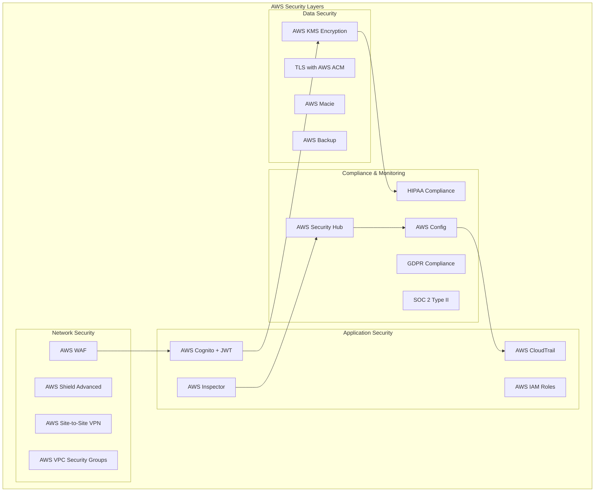

### Data Privacy & Protection
- **Patient Data**: End-to-end encryption
- **Access Control**: Multi-factor authentication
- **Audit Trails**: Complete activity logging
- **Data Retention**: Configurable retention policies
- **Backup & Recovery**: AWS Backup with automated daily backups and cross-region replication

## Module-by-Module Architecture

### 1. Hospital Management System

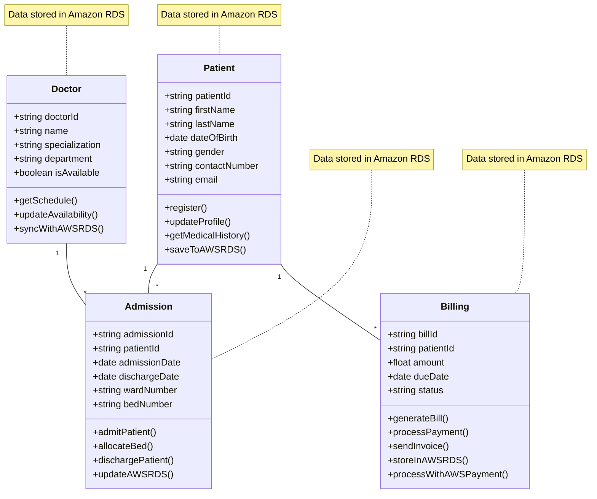

### 2. Telemedicine Platform

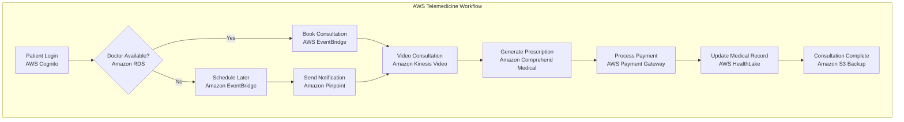

### 3. Pharmacy Management System

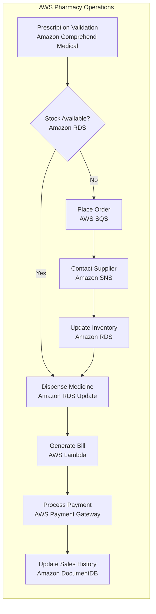

## Data Flow Architecture

### Patient Journey Data Flow

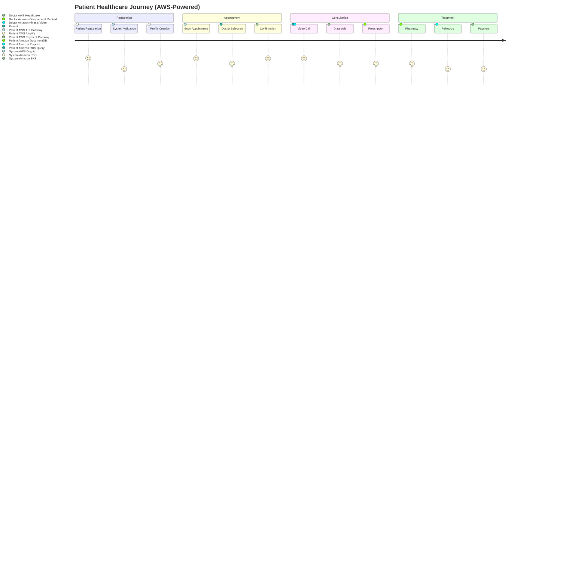

### Cross-Module Data Integration

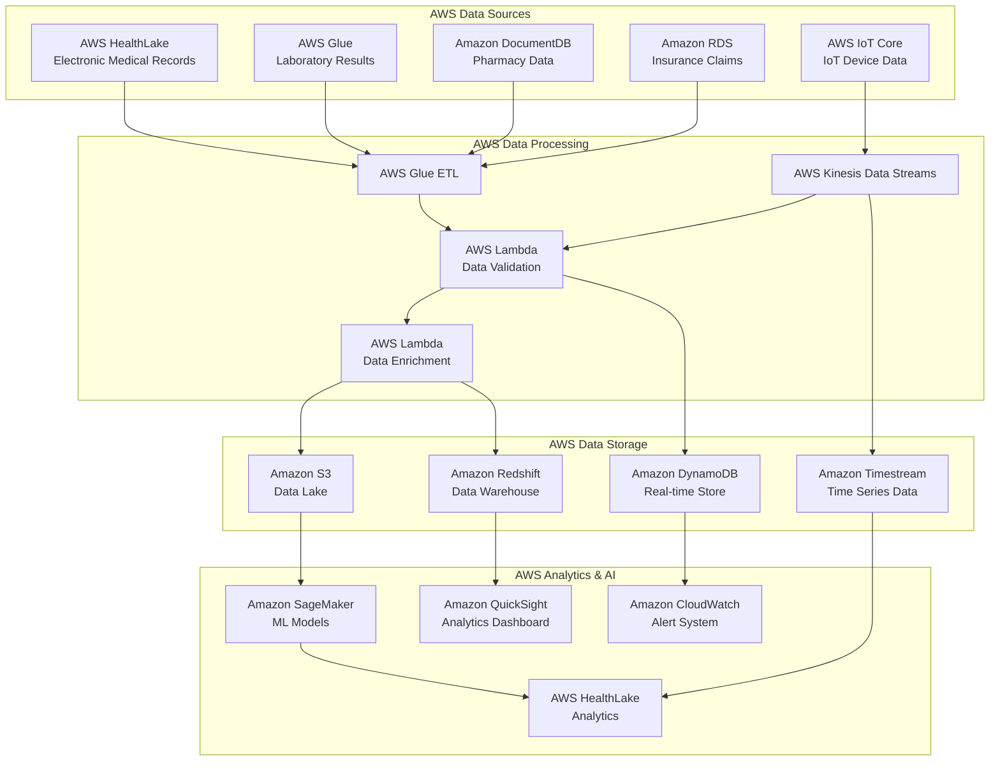

## Implementation Plan

### Phase 1: Foundation (Months 1-2)

#### Core Infrastructure
- AWS Cloud environment setup with VPC, subnets, and security groups
- Amazon EKS cluster configuration with managed node groups
- AWS CodePipeline, CodeBuild, and CodeDeploy for CI/CD
- AWS CloudWatch, CloudWatch Logs, and AWS X-Ray for monitoring and logging
- AWS IAM, AWS KMS, and AWS Security Hub for security framework implementation
- AWS WAF, AWS Shield, and AWS DDoS Protection for network security

#### Core Services
- Authentication & Authorization Service using AWS Cognito
- AWS API Gateway configuration with custom domain and throttling
- Database architecture setup with Amazon RDS, DocumentDB, and ElastiCache
- AWS SQS and SNS for message queue implementation
- Patient Management System (Core Module)

#### Key Deliverables
- ✅ Development environment ready
- ✅ Authentication system functional
- ✅ Patient registration and profile management
- ✅ Basic API documentation

### Phase 2: Core Systems (Months 3-5)

#### Hospital Management System
- Admission & discharge workflows
- Doctor scheduling system
- Bed and ward management
- Medical records integration
- Billing and invoicing

#### Telemedicine Platform
- Video consultation infrastructure using Amazon Kinesis Video Streams
- Appointment booking system with Amazon EventBridge
- Prescription management with Amazon Comprehend Medical
- Payment integration using AWS Payment Gateway integration
- Consultation history stored in Amazon DocumentDB

#### Pharmacy Management System
- Inventory management
- Prescription processing
- Supplier management
- POS system
- Expiry tracking

#### Laboratory Management System
- Test booking and catalog
- Sample tracking
- Result management
- Report generation
- Integration with EHR

### Phase 3: Supporting Systems (Months 6-8)

#### Health Insurance Management
- Policy management
- Claims processing
- Premium calculation
- Customer management
- Workflow automation

#### Appointment & Scheduling System
- Advanced scheduling algorithms
- Resource optimization
- Multi-location support
- Queue management
- Notification system

#### Remote Patient Monitoring
- IoT device integration using AWS IoT Core
- Real-time data collection with AWS IoT Analytics
- Alert system using Amazon SNS and CloudWatch Alarms
- Patient dashboard using AWS Amplify
- Doctor dashboard with real-time updates via AWS AppSync

### Phase 4: Mobile & Analytics (Months 9-11)

#### Mobile Applications
- Patient mobile app (iOS/Android) using AWS Amplify
- Doctor mobile app (iOS/Android) using AWS Amplify
- Offline functionality with AWS AppSync
- Push notifications using Amazon Pinpoint
- User experience optimization with AWS CloudFront CDN

#### Medical Analytics & AI Platform
- Data aggregation pipeline using AWS Glue
- Machine learning models with Amazon SageMaker
- Predictive analytics using Amazon SageMaker Canvas
- Risk scoring algorithms with Amazon SageMaker Autopilot
- Business intelligence dashboards using Amazon QuickSight

### Phase 5: Integration & Testing (Month 12)

#### System Integration
- End-to-end workflow testing
- Performance optimization
- Security audit and penetration testing
- Data migration and validation
- User acceptance testing

#### Deployment Preparation
- Production environment setup with AWS CloudFormation/CDK
- Backup and disaster recovery using AWS Backup and cross-region replication
- Training materials hosted on AWS S3 with CloudFront distribution
- Go-live preparation with AWS CloudFormation stacks
- Post-launch support plan using AWS Support Enterprise

## Timeline & Gantt Chart

### 12-Month Implementation Timeline

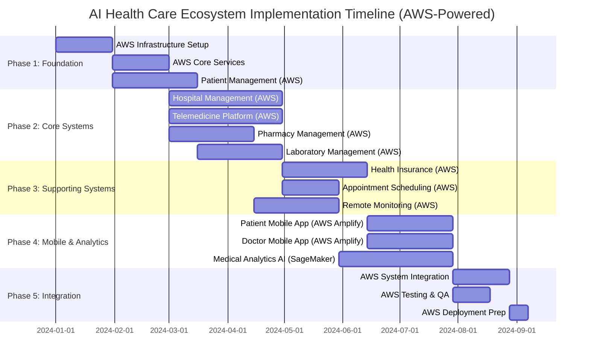

### Resource Allocation

#### Team Structure
- **Project Manager**: 1 FTE (Full-time equivalent)
- **Solution Architect**: 1 FTE
- **Backend Developers**: 4 FTE
- **Frontend Developers**: 3 FTE
- **Mobile Developers**: 2 FTE
- **DevOps Engineers**: 2 FTE
- **QA Engineers**: 2 FTE
- **UI/UX Designers**: 1 FTE
- **Security Specialist**: 1 FTE

#### Budget Estimates
- **AWS Infrastructure**: $50,000/month
  - Compute: Amazon EKS, EC2 instances, Lambda functions
  - Storage: Amazon S3, RDS, DocumentDB, ElastiCache
  - Networking: VPC, CloudFront, Route 53
  - Data Transfer: AWS Data Transfer costs
- **Personnel**: $150,000/month
- **Software Licenses**: $10,000/month
- **AWS Compliance & Security**: $15,000/month
  - AWS Security Hub, AWS Config, AWS IAM Access Analyzer
  - AWS KMS, AWS Certificate Manager
- **AWS Contingency (15%)**: $33,750/month

### Risk Assessment & Mitigation

#### High-Risk Areas
1. **Healthcare Compliance**
   - Risk: Non-compliance with HIPAA/HL7 standards
   - Mitigation: Early engagement with compliance experts, regular audits

2. **Data Security**
   - Risk: Data breaches affecting patient information
   - Mitigation: End-to-end encryption, regular security assessments

3. **Integration Complexity**
   - Risk: Complex integrations between 10 modules
   - Mitigation: API-first approach, comprehensive testing

4. **User Adoption**
   - Risk: Low adoption by healthcare professionals
   - Mitigation: User-centered design, extensive training programs

5. **Performance at Scale**
   - Risk: System performance issues with high load
   - Mitigation: Load testing, scalable architecture design

### Success Metrics

#### Technical Metrics
- **System Availability**: 99.9% uptime using AWS Multi-AZ and Auto Scaling
- **Response Time**: <2 seconds for critical operations with AWS CloudFront CDN
- **Security**: Zero critical vulnerabilities with AWS Security Hub and AWS Inspector
- **Scalability**: Support for 1M+ concurrent users using Amazon EKS Auto Scaling

#### Business Metrics
- **User Adoption**: 80% activation within 3 months
- **Patient Satisfaction**: >4.5/5 rating
- **Operational Efficiency**: 40% reduction in administrative tasks
- **Cost Reduction**: 30% reduction in operational costs

#### Compliance Metrics
- **HIPAA Compliance**: 100% audit pass rate with AWS HIPAA-eligible services
- **Data Privacy**: Zero data breaches with AWS KMS encryption and IAM policies
- **Interoperability**: Full HL7 FHIR compliance with AWS HealthLake integration
- **Audit Trail**: 100% activity logging with AWS CloudTrail and CloudWatch Logs

---

*This document provides a comprehensive architecture and implementation plan for the AI Health Care and Telecommunication ecosystem. The plan emphasizes security, scalability, and healthcare compliance while ensuring a phased approach to development and deployment.*
